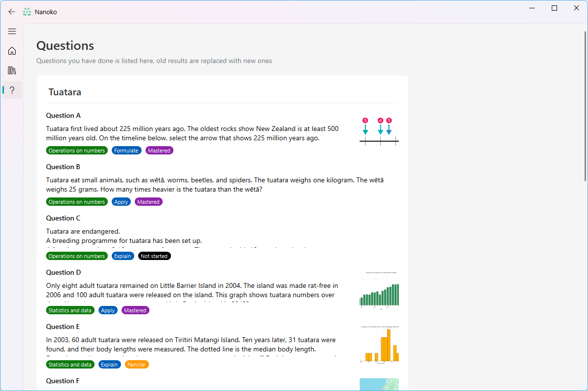
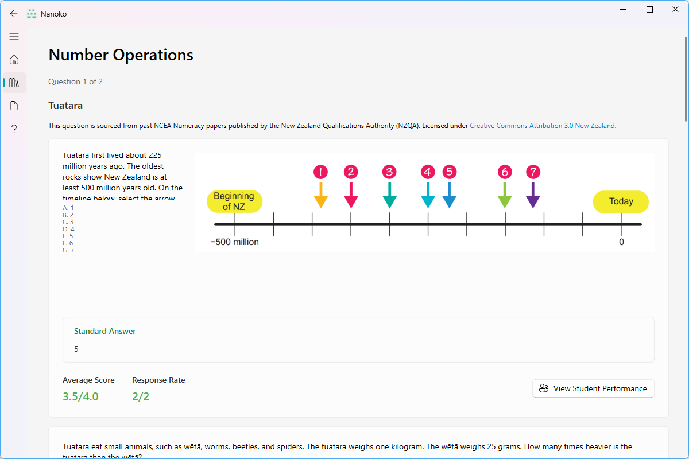

  

# Nanoko

_An AI-powered NCEA Numeracy platform_

## Features

- User-friendly modern interface with PyQt6
- Separate student and teacher clients
- AI integration for instant feedback
- Student data analysis
- Question uploading

## Preview

### Student Client

The student client has 3 main pages - Home, Class, and Question

### Teacher Client

The teacher client has 4 main pages - Home, Class, Assignment, and Question

## Download

Binaries are available for Windows in the [releases](https://github.com/NanokoDev/client/releases) page, built with PyInstaller.

## Known Issues

- Application Crash (Student Client): When users enter the question answering page and submit few sub-questions, there's a small chance that the background refreshing method will delete the PopUpAnIsStackedWidget, causing PyQt to crash when trying to switch pages. A temporary solution is to restart the application automatically when crashing.

- Loading Window (Student Client): When opening the question answering page, a small black window may briefly appear during data fetching from the backend. The cause of this behavior is currently unknown.

- Text Display (Teacher Client): On the question selection page and question reviewing page, texts in CardWidget may be cut off by the border. Users need to fullscreen the application to resolve this display issue.

## License

This project is licensed under the GNU General Public License v3.0 (GPL-3.0). This means you are free to:
- Use this software for any purpose
- Change the software to suit your needs
- Share the software with your friends and neighbors
- Share the changes you make

When you do any of the above, you must:
- Share the complete source code of the modified software
- Include the original license and copyright notices
- State significant changes made to the software
- License any modifications under GPL-3.0

For more details, see the [GNU General Public License v3.0](https://www.gnu.org/licenses/gpl-3.0.en.html).

## Acknowledgements

This project makes use of the following open-source libraries:

- [PyQt-Fluent-Widgets](https://github.com/zhiyiYo/PyQt-Fluent-Widgets) - A fluent design widgets library based on C++ Qt/PyQt/PySide. Licensed under GNU General Public License v3.0
- [nanoko-python](https://github.com/nanoko-project/nanoko-python) - Python SDK for Nanoko. Licensed under MIT License

The original licenses for these dependencies can be found in the `LICENSES` directory:
- `LICENSES/PyQt-Fluent-Widgets-LICENSE`: GPL-3.0 license for PyQt-Fluent-Widgets
- `LICENSES/nanoko-python-LICENSE`: MIT license for nanoko-python